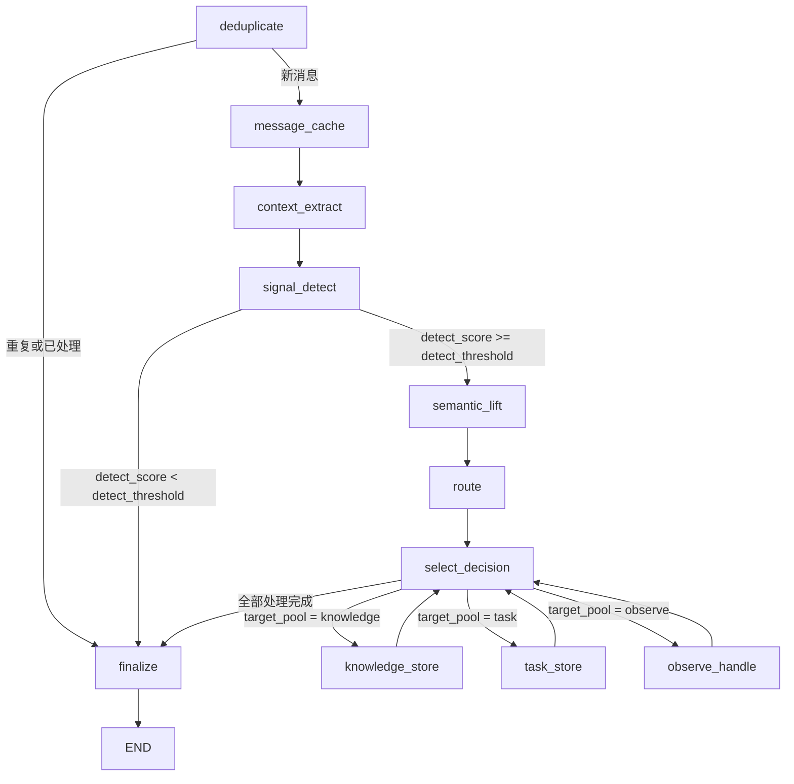

# LangGraph 工作流结构与状态说明

本文档描述本项目 `local_pipeline` 中 LangGraph 工作流的状态字段定义、节点结构与流转逻辑。当前实现集中在 `local_pipeline/flow/engine.py`。

## 状态定义总览

状态类型为 `EngineGraphState`，是继承自 `TypedDict` 的字典类型，定义于 `local_pipeline/flow/engine.py`，包含以下字段：

```python
class EngineGraphState(TypedDict, total=False):
    message: MessageEvent
    result: EngineResult
    simple_messages: list[str]
    detect_score: float
    cards: list[LiftedCard]
    decisions: list[Any]
    decision_index: int
    failed_attempts: list[TaskPushAttempt]
    trace_status: str
    trace_started: bool
```

工作流入口 `Engine.run()` 会初始化上述状态，其中 `message` 是当前飞书消息事件，`result` 是本次处理的统计结果，其他字段使用空列表、`0.0`、`0`、`"ok"` 或 `False` 作为初始值。

## 各字段详细说明

### 1. 核心输入与结果状态

| 状态字段 | 类型 | 作用模块 | 用途说明 |
|---------|------|----------|----------|
| `message` | `MessageEvent` | 所有节点 | 输入的飞书消息事件，包含消息 ID、聊天 ID、消息正文、发送者信息等，是整个工作流的处理对象。 |
| `result` | `EngineResult` | 所有节点 | 全局结果统计对象，记录候选命中、路由计数、任务推送、RAG 检索、observe 自动回复/发酵/弹出、错误与告警等信息，最终返回给调用方并写入 `realtime_events.jsonl`。 |

### 2. 上下文与中间处理状态

| 状态字段 | 类型 | 作用模块 | 用途说明 |
|---------|------|----------|----------|
| `simple_messages` | `list[str]` | `context_extract` -> `signal_detect` -> `semantic_lift` | 简化格式的上下文消息列表。`context_extract` 从聊天缓存中取最近 `context_window_size` 条消息，并转换为 `MessageEvent.get_simple_message()` 格式，供信号检测和语义升维使用。 |
| `detect_score` | `float` | `signal_detect` -> 条件分支 `_after_signal_detect` | 当前上下文中最后一条有效消息的价值分数，范围为 0 到 100。`signal_detect` 通过 LLM 或规则计算该分数，并和 `EngineConfig.detect_threshold` 比较；低于阈值时直接进入 `finalize`，达到阈值时进入 `semantic_lift`。 |
| `cards` | `list[LiftedCard]` | `semantic_lift` -> `route` -> 各处理节点 | `semantic_lift` 对当前消息和上下文进行语义升维后生成的结构化卡片，包含标题、摘要、问题、建议、参与人、时间地点、证据、标签、置信度、建议目标池、决策信号和缺失字段等信息，是后续路由和存储的核心对象。 |

### 3. 路由与决策状态

| 状态字段 | 类型 | 作用模块 | 用途说明 |
|---------|------|----------|----------|
| `decisions` | `list[Any]` | `route` -> `select_decision` -> 各处理节点 | `route` 对每张卡片生成的路由决策列表。每个决策包含 `card_id`、`target_pool`、`reason_codes`、`threshold_snapshot` 和最终写入后的 `stored_id`。目标池只能是 `knowledge`、`task`、`observe`。同一张卡片可以被展开为多个目标池，例如同时写入知识库和任务池。 |
| `decision_index` | `int` | `route` -> `select_decision` -> 各处理节点 | 当前正在处理的决策索引。`route` 将其重置为 0；`knowledge_store`、`task_store`、`observe_handle` 每处理完一个决策就自增 1；当索引大于等于 `decisions` 长度时进入 `finalize`。 |

### 4. 辅助状态

| 状态字段 | 类型 | 作用模块 | 用途说明 |
|---------|------|----------|----------|
| `failed_attempts` | `list[TaskPushAttempt]` | `task_store` -> `finalize` | 记录任务推送失败的尝试。`task_store` 在推送失败时追加失败记录，`finalize` 统一写入重试队列。 |
| `trace_status` | `str` | `task_store` / `observe_handle` -> `finalize` | 链路追踪的结束状态，默认 `"ok"`；任务推送失败或 observe 自动回复发送失败时设为 `"failed"`，最终传给 `trace_finish()`。 |
| `trace_started` | `bool` | `deduplicate` -> `finalize` | 标记是否已经启动链路追踪。去重通过且 `step_trace_enabled=True` 时设置为 `True`，`finalize` 据此决定是否写入结束追踪。 |

## 本项目 LangGraph 结构

当前图由 `Engine._build_graph()` 构建，入口节点是 `deduplicate`，结束节点是 LangGraph 的 `END`。



### 1. 去重与入库前准备

`deduplicate` 使用 `RuntimeState.try_start(message_id)` 防止重复处理同一条消息。若消息已经在处理中或已成功处理过，节点将 `result.skipped` 设为 `True`，随后通过条件边直接进入 `finalize`。若是新消息，节点会在开启链路追踪后进入 `message_cache`。

`message_cache` 负责把当前消息追加到 `ChatMessageStore`，同时尝试用消息事件更新用户身份映射。该节点不修改 LangGraph 状态字段，只产生本地持久化副作用。

`context_extract` 从同一个 chat 的历史消息中截取最近 `context_window_size` 条，转换为简化文本，写入 `simple_messages`。这个设计让后面的检测和升维始终看到包含当前消息在内的短上下文窗口。

### 2. 信号检测与门控

`signal_detect` 调用 `detect_candidates(simple_messages)`，得到 `DetectionResult.value_score` 并写入 `detect_score`。当前实现不再把候选对象列表放入状态，而是用单个分数作为是否继续处理的门控。

`_after_signal_detect` 会将 `detect_score` 与 `EngineConfig.detect_threshold` 比较。低于阈值说明当前消息价值不足，直接进入 `finalize`；达到阈值时将 `result.candidate_count` 记为 1，并进入 `semantic_lift`。

### 3. 语义升维与路由

`semantic_lift` 调用 `lift_candidates(simple_messages)`，将当前消息和上下文整理成 `LiftedCard`。升维阶段会尽量使用 LLM 生成结构化字段；当 LLM 不可用或失败时，保留启发式兜底结果，并把告警追加到 `result.warnings`。

`route` 调用 `route_cards(cards)` 生成 `RouteDecision` 列表，并按目标池更新 `result.routed_counts`。路由优先使用 LLM，失败时回退到规则；规则会综合 `suggested_target`、`message_role`、`decision_signals`、`missing_fields`、`tags` 和置信度。同一张卡片可以路由到多个目标池，`route` 会把 `decision_index` 重置为 0，交给后续循环依次处理。

### 4. 决策循环与目标池处理

`select_decision` 本身不修改状态，它只作为条件分支节点使用。`_next_decision_target` 根据 `decision_index` 取出当前 `RouteDecision`：目标池为 `knowledge` 时进入 `knowledge_store`，为 `task` 时进入 `task_store`，其他情况进入 `observe_handle`；如果索引已经越过决策列表，则进入 `finalize`。

`knowledge_store` 找到当前决策对应的 `LiftedCard` 后写入知识库，并把写入结果 ID 回填到 `decision.stored_id`。写入后会执行 observe 逻辑 2 检查，并调用 `_process_observe_pop()` 处理可能达到发酵阈值的 observe 项。节点结束时将 `decision_index` 加 1 并回到 `select_decision`。

`task_store` 会在启用 RAG 时先检索知识库，并用命中的知识增强任务卡片，然后写入任务池。若启用任务推送，节点会记录推送尝试、成功、失败数量；失败时追加错误、把 `trace_status` 设为 `"failed"`，并把失败尝试放入 `failed_attempts`。它也会执行 observe 逻辑 3 和 observe 弹出处理，最后递增 `decision_index`。

`observe_handle` 处理暂不适合直接沉淀为知识或任务的信号。它会判断卡片是否像一个问题；在自动回复和 RAG 开启时尝试检索并回复，能回答则记录 `observe_answered_count`，不能回答或发送失败则进入 observe 存储兜底。存储 observe 后会执行 observe 逻辑 1，并处理可能的 observe 弹出，最后递增 `decision_index`。

### 5. Observe 发酵与弹出

Observe 发酵不是 LangGraph 中独立注册的节点，而是在 `knowledge_store`、`task_store`、`observe_handle` 内部触发：

- observe 逻辑 1：新增 observe 后，根据当前消息和已有 observe 状态增加发酵分。
- observe 逻辑 2：新增知识后，检查是否能推动已有 observe 发酵。
- observe 逻辑 3：新增任务后，检查是否能推动已有 observe 发酵。
- `_process_observe_pop()`：从本地状态中取出达到阈值的 observe 项，构造 `LiftedCard`，重新调用 `route_cards()` 判断应转为任务还是知识；若仍被路由到 observe 且配置要求强制非 observe，则按卡片建议目标转为任务或知识。

因此，主图只表达消息处理主流程；observe 的成熟、再路由和落库是处理节点内部的副流程，并通过 `EngineResult` 的 observe 相关计数字段和 `observe_*_events.jsonl` 文件体现。

### 6. 收尾与持久化

`finalize` 负责统一收尾：将 `failed_attempts` 写入任务推送重试队列；若消息不是重复跳过，则调用 `RuntimeState.finish(..., success=True)` 标记已处理；把 `EngineResult` 追加到 `realtime_events.jsonl`；最后在需要时写入链路追踪结束事件。`finalize` 之后图进入 `END`，`Engine.run()` 返回最终状态中的 `result`。

## 状态流转逻辑

1. **初始化**：`Engine.run()` 创建 `EngineResult`，并初始化 LangGraph 状态。
2. **去重**：`deduplicate` 判断是否跳过，重复消息直接收尾，新消息进入缓存和上下文提取。
3. **门控**：`signal_detect` 只输出 `detect_score`，由条件边决定继续升维还是结束。
4. **升维与路由**：`semantic_lift` 生成 `cards`，`route` 生成 `decisions` 并重置 `decision_index`。
5. **循环处理**：`select_decision` 根据当前决策选择目标池节点，目标池节点处理完成后递增索引并回到 `select_decision`。
6. **结束流程**：所有决策处理完毕、信号低于阈值或消息被跳过时进入 `finalize`，最终返回 `result`。

## 设计特点

- 节点只返回需要更新的状态字段，LangGraph 负责把增量更新合并到全局状态。
- 价值判断采用 `detect_score` 阈值门控，避免低价值消息进入升维和路由阶段。
- 路由结果用 `decisions + decision_index` 串行消费，支持一张卡片进入多个目标池。
- 任务推送失败通过 `failed_attempts` 延后到 `finalize` 统一入重试队列，避免处理节点直接承担收尾职责。
- Observe 的发酵与再路由作为目标池处理节点内部副流程存在，主图保持清晰，同时保留自动回复、发酵事件和弹出事件的可追踪性。
- 全流程的业务统计集中在 `EngineResult`，便于离线报告、测试断言和线上运行排查。
