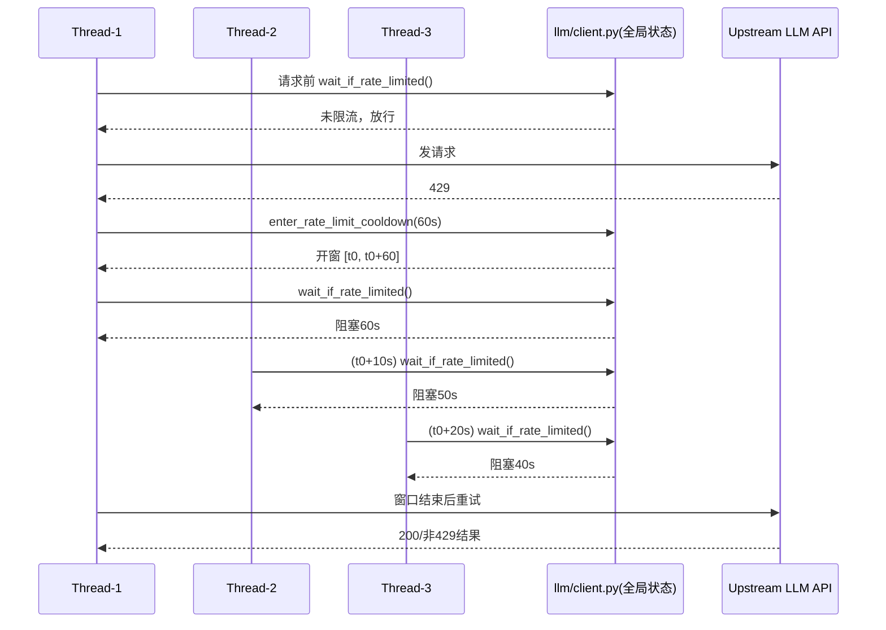
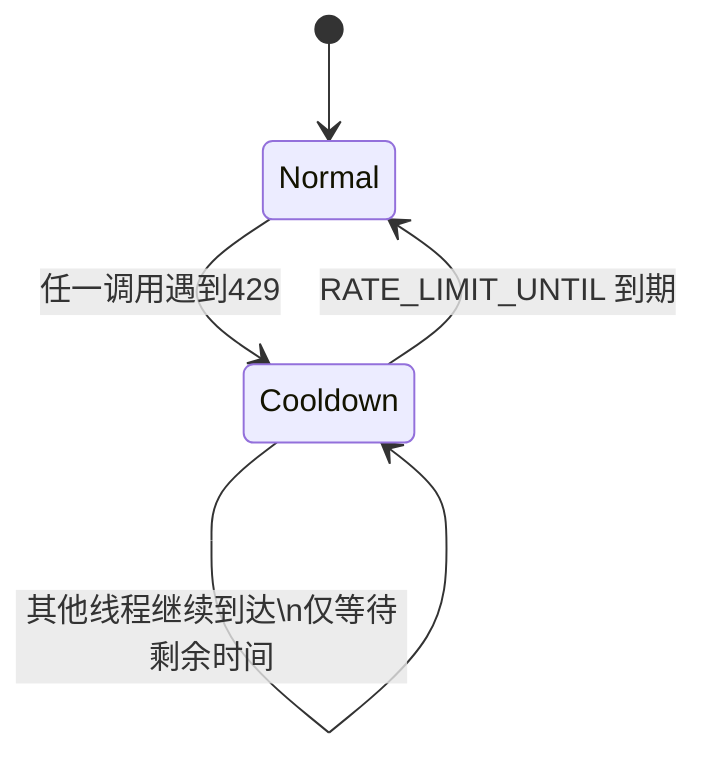

# Client 侧 429 全局阻塞重试机制说明

## 1. 目标与范围

本文档说明 `llm/client.py` 中实现的 **429（Rate Limit）全局阻塞重试机制**。  
该机制仅在 **Client 层** 生效，不依赖上游是否为多线程/多进程，也不改动上层业务流程。

- 生效文件：`llm/client.py`
- 生效范围：当前 Python 进程内（in-process）
- 适用调用：
  - `invoke_structured(...)`
  - `LLMClient.build_reply(...)`

---

## 2. 核心设计

### 2.1 全局状态变量

在模块级维护以下共享状态：

- `RATE_LIMIT_ACTIVE: bool`  
  当前是否处于“限流等待窗口”。

- `RATE_LIMIT_UNTIL: float`  
  等待窗口结束时间（`time.monotonic()` 时间基准）。

- `RATE_LIMIT_LOCK: RLock`  
  保护上述状态，避免并发竞争。

- `RATE_LIMIT_COOLDOWN_SECONDS: float = 60.0`  
  基础等待时长。

- `RATE_LIMIT_SAFETY_SECONDS: float = 0.0`  
  可选安全缓冲（例如可设为 `1~2` 秒）。

### 2.2 两个关键函数

#### `_enter_rate_limit_cooldown(seconds=None)`

作用：在检测到 429 时尝试“开窗”。

规则：
1. 若当前未处于等待状态，则设置：
   - `RATE_LIMIT_ACTIVE = True`
   - `RATE_LIMIT_UNTIL = now + cooldown`
2. 若已处于等待状态且窗口未过期，则**不重置、不延长**窗口。

这保证了“首个 429 决定窗口，后续 429 共享窗口”。

#### `_wait_if_rate_limited()`

作用：请求发出前检查是否处于等待窗口。

规则：
1. 若 `RATE_LIMIT_ACTIVE=False`：立即返回。
2. 若仍在窗口内：计算 `remaining = RATE_LIMIT_UNTIL - now`，阻塞 `sleep(remaining)`。
3. 窗口到期后清理状态：
   - `RATE_LIMIT_ACTIVE = False`
   - `RATE_LIMIT_UNTIL = 0.0`

---

## 3. 调用流程

两个入口都采用同一模式：

1. 每次请求前先调用 `_wait_if_rate_limited()`。
2. 发起真实 LLM 请求。
3. 若异常属于 429/RPM：
   - 调用 `_enter_rate_limit_cooldown()`（仅首次真正开窗）
   - 继续循环重试（无限重试）
4. 若非 429：
   - 保持原有错误处理逻辑（不进入该等待机制）

---

## 4. 并发语义（与你的示例一致）

假设 3 个线程：

- `t=0s`：线程1收到 429，开窗到 `t=60s`
- `t=10s`：线程2收到 429，发现窗口已开，不重置；应等待 `50s`
- `t=20s`：线程3收到 429，发现窗口已开，不重置；应等待 `40s`

即：**后续线程按“剩余时间”等待，而不是重新计 60 秒。**

---

## 5. 时序图

---

## 6. 状态机图

---

## 7. 为什么不延长窗口

“已开窗时再次 429 不延长”是刻意设计，原因：

1. 避免多线程下反复刷新截止时间导致“永远等不到头”。
2. 等待行为可预测，便于排查与容量评估。
3. 与“首个触发负责开窗，其他线程共享剩余时间”的语义一致。

---

## 8. 配置建议

- 默认：
  - `RATE_LIMIT_COOLDOWN_SECONDS = 60`
  - `RATE_LIMIT_SAFETY_SECONDS = 0`

- 若上游限流窗口边界抖动明显，可将 `RATE_LIMIT_SAFETY_SECONDS` 调到 `1~2` 秒。

---

## 9. 已有测试覆盖

对应测试文件：`tests/test_llm_client_rate_limit.py`

覆盖点：
1. 已处于窗口时重复触发 429，不会延长 `RATE_LIMIT_UNTIL`
2. 剩余时间阻塞语义正确（50s/40s）
3. 并发调用在共享窗口下最终可恢复成功

